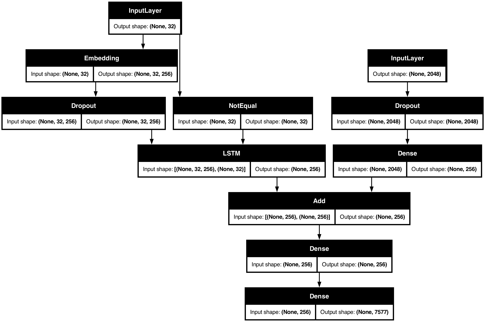

---

# 🖼️ Image Caption Generator

This project implements an **Image Captioning Model** that combines **Computer Vision (CNN)** and **Natural Language Processing (RNN/LSTM)** to generate descriptive captions for images.

---

## 📌 Features

* Preprocessing of text captions and images
* Vocabulary creation and text cleaning
* Image feature extraction using Xception (or similar CNN)
* Sequence modeling with LSTMs
* Training script to build and save models
* Support for multiple saved models (`.h5`)

---

## 📂 Project Structure

```
Image_Caption_Gen/
│── model/                # Saved models (.h5) [ignored in GitHub]
│── utils/                # Helper scripts
│   ├── data_loader.py
│   ├── image_processing.py
│   ├── sequence_utils.py
│   └── text_processing.py
│── train.py              # Training script
│── caption_model.py      # Model architecture
│── requirements.txt      # Python dependencies
│── README.md             # Project documentation
│── model.png             # Model architecture diagram
│── venv/                 # Virtual environment [ignored in GitHub]
```

---

## 🚀 Setup & Installation

1. Clone this repository:

   ```bash
   git clone https://github.com/<your-username>/Image_Captioning.git
   cd Image_Captioning
   ```

2. Create a virtual environment & activate it:

   ```bash
   python3 -m venv venv
   source venv/bin/activate   # Mac/Linux
   venv\Scripts\activate      # Windows
   ```

3. Install dependencies:

   ```bash
   pip install -r requirements.txt
   ```

---

## 🛠️ Usage

### 1. Preprocess Captions

```bash
python utils/text_processing.py
```

### 2. Process Images

```bash
python utils/image_processing.py
```

### 3. Train Model

```bash
python train.py
```

Trained models are saved in the `model/` directory as `.h5` files.

---

## 📊 Model

* **CNN (Xception)** → extracts image features
* **Tokenizer + Embedding** → prepares text captions
* **LSTM** → learns caption sequences
* **Dense layer with Softmax** → predicts the next word



---

## ⚠️ Note

* `.h5` files are large and are not uploaded to GitHub. Store them in cloud (Google Drive, Hugging Face Hub, etc.) and update the README with the link.
* `venv/` and cache files are ignored using `.gitignore`.

---

## 📌 Future Improvements

* Beam search for better caption generation
* Transformer-based encoder-decoder
* Web app demo with Flask/Streamlit

---

## 🤝 Contributing

Pull requests are welcome! For major changes, please open an issue first to discuss.

---
